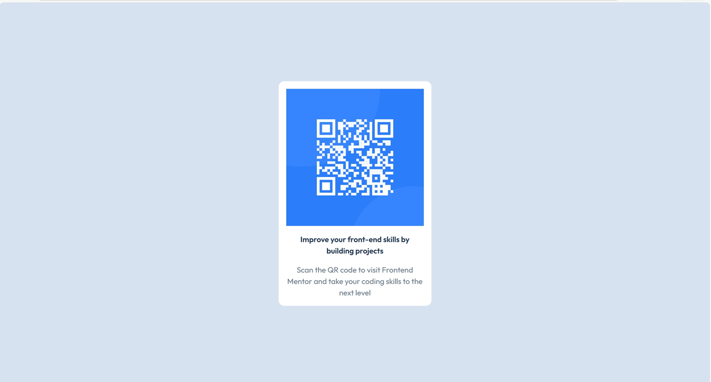

# Frontend Mentor - QR code component solution

This is a solution to the [QR code component challenge on Frontend Mentor](https://www.frontendmentor.io/challenges/qr-code-component-iux_sIO_H). Frontend Mentor challenges help you improve your coding skills by building realistic projects. 

## Table of contents

- [Overview](#overview)
  - [Screenshot](#screenshot)
  - [Links](#links)
- [My process](#my-process)
  - [Built with](#built-with)
  - [What I learned](#what-i-learned)
  - [Continued development](#continued-development)
  - [Useful resources](#useful-resources)
- [Author](#author)

## Overview
The QR Code Component is a simple yet well-structured UI card built using
semantic HTML, modern CSS practices, and Tailwind CSS utilities.  
The component is fully centered, responsive, and designed with a
content-driven layout approach (avoiding fixed heights).

This project demonstrates my understanding of:
- Flexbox-based layouts
- Component-oriented CSS naming
- Responsive sizing using `max-width`
- Clean separation between layout and styling responsibilities

### Screenshot

### Links

- Solution Repository: [https://github.com/hemadrikhandelwal/frontend_mentor_solutions/tree/qr-code/qr-code/qr-code-component-main](https://your-solution-url.com)
- Live Site URL: [https://qr-code-rosy-six.vercel.app/](https://your-live-site-url.com)

## My process
 
 I approached this project with a component-first mindset. The focus was on
building a reusable card layout using Flexbox, ensuring proper alignment,
spacing, and readability across screen sizes.

Special attention was given to:
- Avoiding fixed heights
- Using meaningful, responsibility-based class names
- Keeping the HTML structure simple and semantic

### Built with

- Semantic HTML5 markup
- CSS custom properties
- Flexbox
- Tailwind CSS
- Google Fonts (Outfit)

### What I learned

Through this project, I strengthened my understanding of:

- Creating card components using `max-width` instead of fixed dimensions
- Managing layout and spacing with Flexbox
- Writing cleaner, more maintainable CSS class names
- Structuring small UI components in a scalable way
- Combining utility-first CSS (Tailwind) with custom component styles

### Continued development

In future projects, I plan to focus on:
- Improving CSS architecture and folder structure
- Strengthening naming conventions across components
- Practicing more layout patterns using both Flexbox and Grid
- Building reusable UI components with better accessibility

### Useful resources

- [https://tailwindcss.com/](https://www.example.com) -  Helped me understand utility-first styling and layout patterns.
- [https://www.w3schools.com/](https://www.example.com) - Useful for revisiting core HTML and CSS concepts.

## Author

- Name - [Hemadri Khandelwal]
- Frontend Mentor - [@hemadrikhandelwal](https://www.frontendmentor.io/profile/hemadrikhandelwal)

