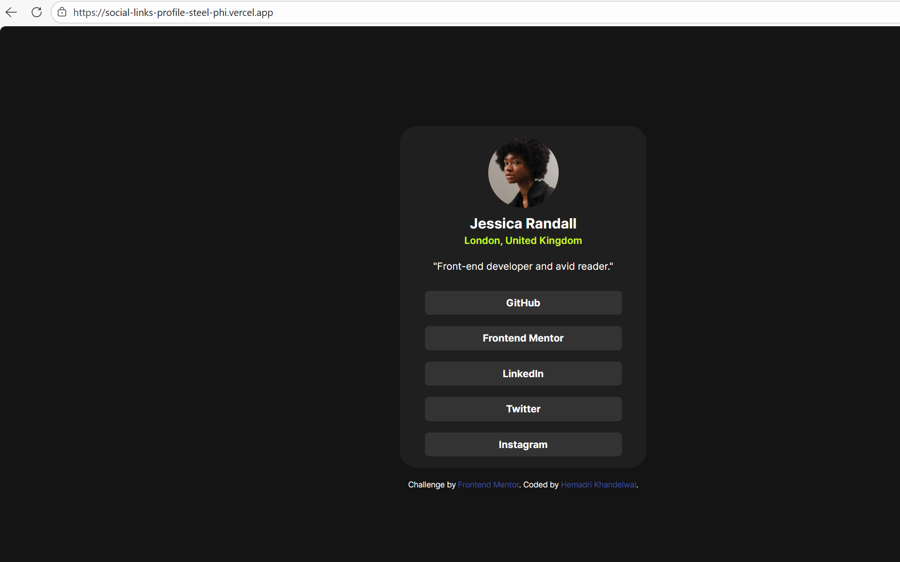

# Frontend Mentor - Social links profile solution

This is a solution to the [Social links profile challenge on Frontend Mentor](https://www.frontendmentor.io/challenges/social-links-profile-UG32l9m6dQ). Frontend Mentor challenges help you improve your coding skills by building realistic projects. 

## Table of contents

- [Overview](#overview)
  - [The challenge](#the-challenge)
  - [Screenshot](#screenshot)
  - [Links](#links)
- [My process](#my-process)
  - [Built with](#built-with)
  - [What I learned](#what-i-learned)
  - [Continued development](#continued-development)
  - [Useful resources](#useful-resources)
- [Author](#author)

## Overview

Users should be able to:

- View a responsive social links profile card.

- See hover and focus states for all interactive elements.

- Experience consistent typography and spacing across devices.

### The challenge

Users should be able to:

- See hover and focus states for all interactive elements on the page

### Screenshot

### Links

- Solution URL: [https://github.com/hemadrikhandelwal/frontend_mentor_solutions/tree/social-link-preview/social-link-profile/social-links-profile-main](https://github.com/hemadrikhandelwal/frontend_mentor_solutions/tree/social-link-preview/social-link-profile/social-links-profile-main)
- Live Site URL: [https://social-links-profile-steel-phi.vercel.app/](https://social-links-profile-steel-phi.vercel.app/)

## My process

### Built with

- Semantic HTML5 markup
- CSS custom properties
- Flexbox
- TailWind CSS
- Custom font integration using @font-face

### What I learned

While working on this project, I focused on improving structure, styling consistency, and maintainability.

Key learnings include:

- Using semantic HTML (main, section, headings) to improve accessibility and readability

- Managing a consistent color system using CSS custom properties

- Understanding the limitations of Tailwind CDN, especially around @apply

- Structuring layouts cleanly with Flexbox

- Improving UI feedback using hover and focus states

### Continued development

Going forward, I plan to focus on:

- Improving accessibility (keyboard navigation, ARIA roles, contrast)

- Creating reusable UI components to avoid repetition

- Moving from Tailwind CDN to a build-based setup for better scalability

- Enhancing responsive behavior using Tailwind breakpoints

- Applying a design-system mindset for future projects

## Author

- Website - Hemadri Khandelwal
- Frontend Mentor - [@hemadrikhandelwal](https://www.frontendmentor.io/profile/hemadrikhandelwal)

